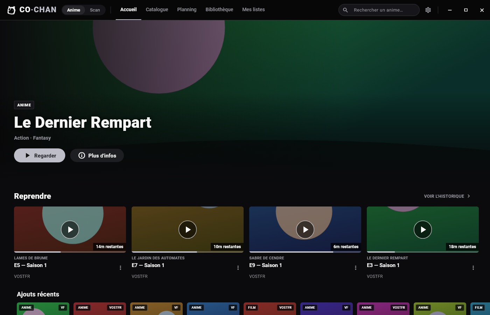
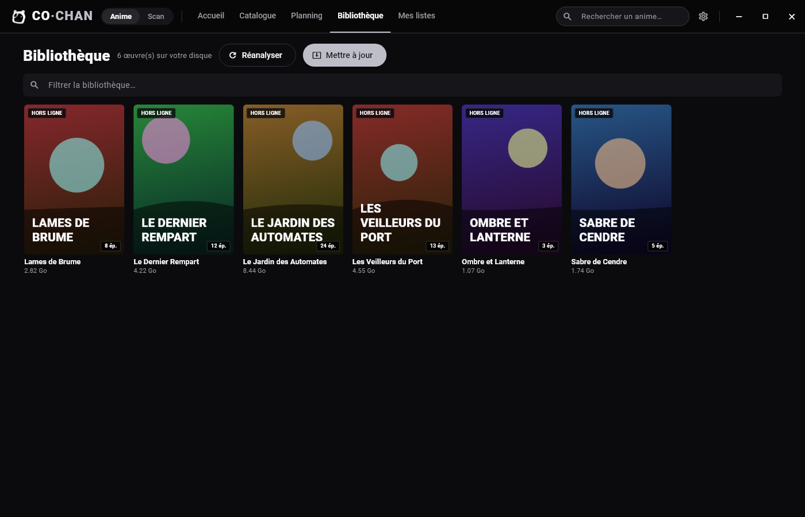
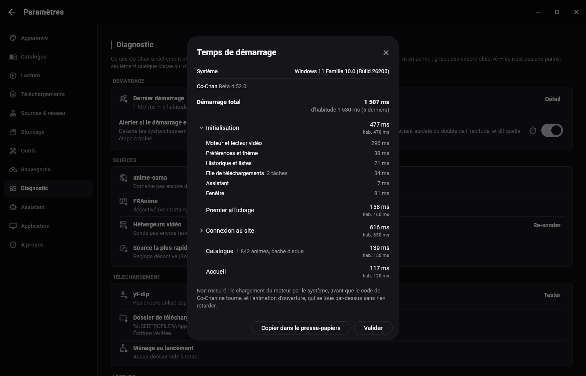
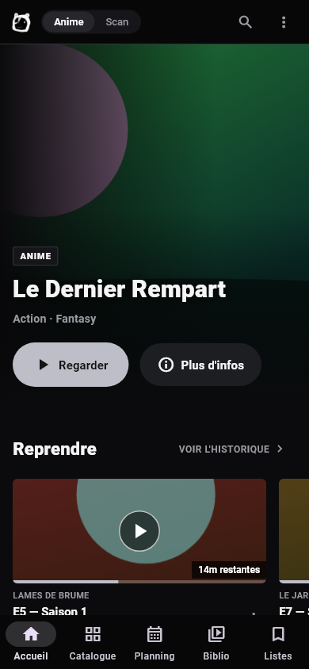
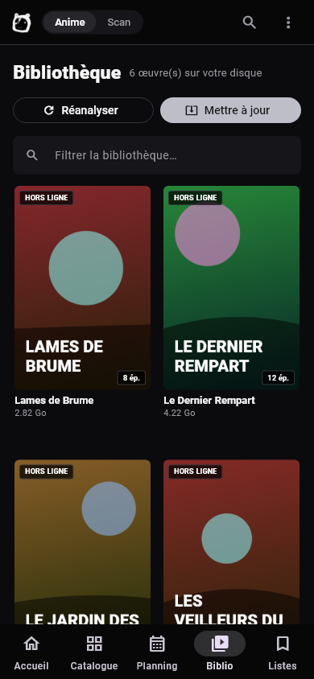

# Co-Chan

**Regarder et télécharger des animes, sans publicité et sans compte.**

Co-Chan est une application pour Windows, Linux et Android : on cherche une
série, on lance un épisode, et on le garde pour plus tard si on veut. Elle
reprend là où vous vous étiez arrêté, saute les génériques, et lit ce qui est
téléchargé même sans connexion.

---

## Aperçu

*Accueil sur ordinateur : la série à la une, la rangée « Reprendre » avec le temps restant de chaque épisode, puis les ajouts récents.*

*Bibliothèque sur ordinateur : les séries téléchargées, avec leur nombre d'épisodes et la place qu'elles occupent, disponibles hors ligne.*

*Paramètres, onglet Diagnostic : l'état de chaque élément (pastille par ligne) et le temps de démarrage détaillé étape par étape.*

*Accueil sur téléphone, avec la barre de navigation en bas.*

*Bibliothèque sur téléphone.*

---

## Ce que vous y trouverez

- **Un lecteur complet** : reprise automatique, saut d'intro, épisode suivant
  enchaîné, vitesse et volume au clavier, et un mode vignette pour garder
  l'épisode dans un coin de l'écran pendant que vous faites autre chose.
- **Des téléchargements qui tiennent** : plusieurs épisodes à la fois, file
  d'attente, reprise après coupure, et sur téléphone ça continue écran éteint.
- **Une bibliothèque hors ligne** : ce qui est téléchargé se regarde sans
  réseau, avec la place occupée par série.
- **Un diagnostic honnête** : l'état de chaque élément (site, hébergeurs
  vidéo, outil de téléchargement) avec une pastille par ligne — et « pas
  encore observé » plutôt qu'un faux vert.
- **Aucun compte, aucune publicité, aucune télémétrie.**

---

## Ce que Co-Chan n'est pas

Co-Chan **n'héberge aucun contenu** : c'est un client qui lit des pages
publiques, comme le ferait un navigateur. Il n'a aucune affiliation avec les
sites dont il lit les pages, et ne fournit lui-même aucune vidéo.

---

## Installation

- **Windows** : `cochan-vX.Y.Z.exe`, installation dans votre profil, sans
  droit administrateur.
- **Android** : `cochan-vX.Y.Z.apk`. Android demandera de confirmer une
  installation venant d'une source extérieure au Play Store : c'est attendu.
- **Linux** : `cochan-vX.Y.Z-linux-x64.tar.gz`, à décompresser puis lancer
  `co-chan.sh`.

Les versions sont publiées dans les [releases](../../releases) de ce dépôt
(étiquette `Co-Chan`), ou s'installent en un clic depuis **Co-Menu**, la
bibliothèque d'applications de Bicode_DEV, qui gère aussi les mises à jour.

> ⚠ **Android 7 à 12** : si vous venez d'une version antérieure à la 4.51.1,
> il faut désinstaller puis réinstaller (la clé de signature a changé).
> Exportez vos données avant, dans Paramètres → Sauvegarde.

---

*Ce dépôt sert aussi à distribuer le modèle de langue embarqué de Co-Chan
(étiquette `Co-Chan-LLM`).*

*Bicode_DEV — même famille que **Co-Menu** (la bibliothèque d'applications),
**Co-Musique**, **Co-Craft**, **Co-Santé**, **Co-Rappelle**, **Co-Saturnia**
et **Arcanum.block**.*
